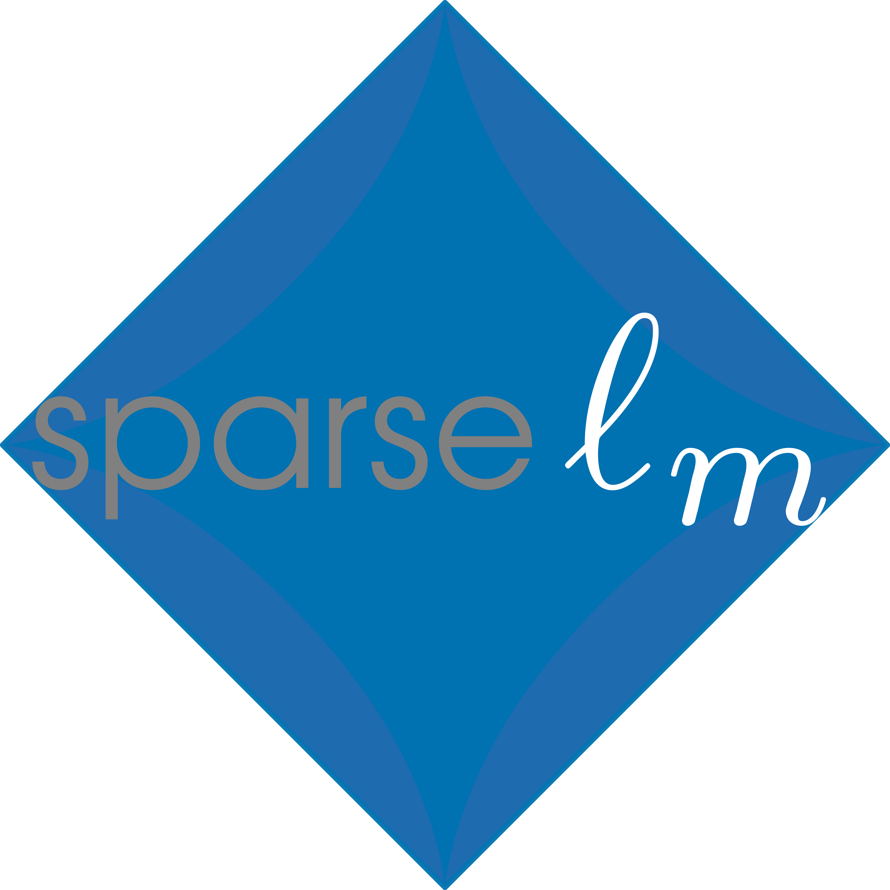

Sparse Linear Regression Models
===============================
[](https://github.com/CederGroupHub/sparse-lm/actions/workflows/test.yml)
[](https://www.codacy.com/gh/CederGroupHub/sparse-lm/dashboard?utm_source=github.com&utm_medium=referral&utm_content=CederGroupHub/sparse-lm&utm_campaign=Badge_Coverage)
[](https://results.pre-commit.ci/latest/github/CederGroupHub/sparse-lm/main)
[](https://pypi.org/project/sparse-lm)

**sparse-lm**  includes several (structured) sparse linear regression estimators that are absent in the
`sklearn.linear_model` module. The estimators in **sparse-lm** are designed to fit right into
[scikit-learn](https://scikit-learn.org/stable/index.html), but the underlying optimization problem is expressed and
solved by leveraging [cvxpy](https://www.cvxpy.org/).

---------------------------------------------------------------------------------------

Available regression models
---------------------------
- Lasso, Group Lasso, Overlap Group Lasso, Sparse Group Lasso & Ridged Group Lasso.
- Adaptive versions of Lasso, Group Lasso, Overlap Group Lasso, Sparse Group Lasso & Ridged Group Lasso.
- Best Subset Selection, Ridged Best Subset, L0, L1L0 & L2L0 (all with optional grouping of parameters)

Basic usage
-----------
If you already use **scikit-learn**, using **sparse-lm** will be very easy. Just use any
model like you would any linear model in **scikit-learn**:

```python
import numpy as np
from sklearn.datasets import make_regression
from sklearn.model_selection import GridSearchCV
from sparselm import AdaptiveLasso

X, y = make_regression(n_samples=200, n_features=5000, random_state=0)
alasso = AdaptiveLasso(fit_intercept=False)
param_grid = {'alpha': np.logsppace(-7, -2)}

cvsearch = GridSearchCV(alasso, param_grid)
cvsearch.fit(X, y)
print(cvsearch.best_params_)
```

For more details on use and functionality see the [documentation](https://cedergrouphub.github.io/sparse-lm/).
